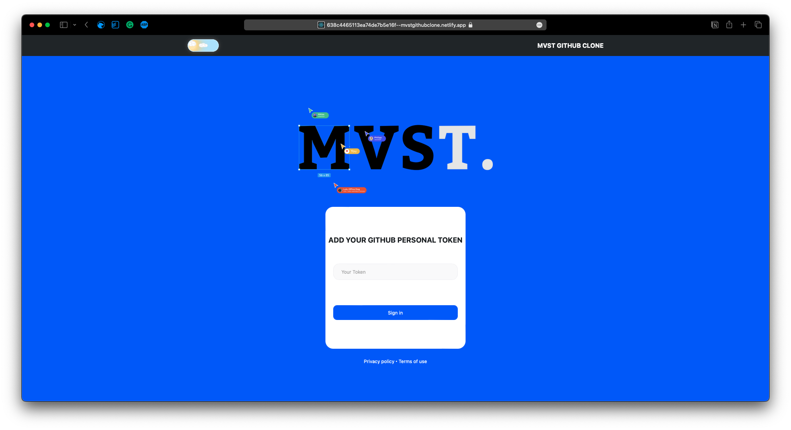
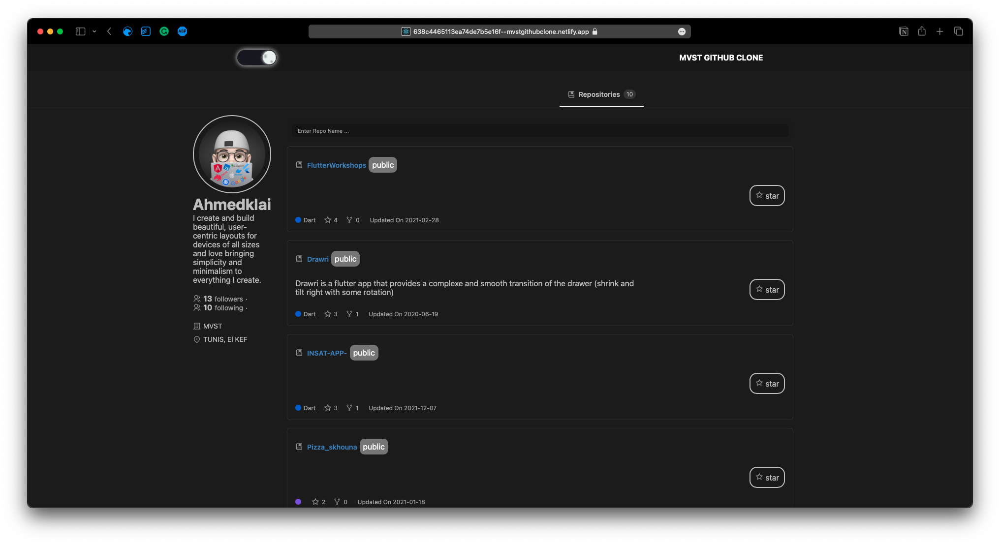

## MVST CLONE UI CHALLENGE BY AHMED KLAI

      

This project was part of an UI Clone challenge, the idea was to replicate (partially) the Github's Profile page using ReactJS , styled-components , userStories . I tried to use both SOLID and DRY principles along the way .
Also the the data Fetching we used GraphQl Api from Github and get along with their explorer to deliver the desired data to the front end 

Deployed [here](https://638c4465113ea74de7b5e16f--mvstgithubclone.netlify.app).

## Features

- Dark/light Mode
- Using GraphQl API
- Using Cutom Hooks
- Using Styled Components 
- Get Full Details of  Your Github Repos with Your Github Token
- Search In Your Repos 
- Loading and Error States are implemented

## Future Improvements 
- [ ] Add the Full Repo page 
- [ ] Add the ability to interact with the repos (star it , unstarr , get the clone link ...)
- [ ] Add the ability to interact with the user (follow , unfollow )
- [ ] Enhancce the UserStories 
- [ ] Work More on the Testing Side 
- [ ] Add the last year actitvity chart to the repo 
- [ ] Add The overView Tab to the profile
- [ ] Add Sorting to the repositories 
- [ ] Add Debouncing to the serch

## Available Scripts

In the project directory, you can run:

### `npm run start`

Runs the app in the development mode.\
Open [http://localhost:3000](http://localhost:3000) to view it in your browser.

The page will reload when you make changes.\
You may also see any lint errors in the console.

### `npm run start`

Runs the app in the development mode.\
Open [http://localhost:3000](http://localhost:3000) to view it in your browser.

The page will reload when you make changes.\
You may also see any lint errors in the console.

### `npm run storybook`

It will start Storybook locally and output the address.\
Depending on your system configuration, it will automatically \
open the address in a new browser tab, and you'll be greeted by a welcome screen.

### `npm run build`

Builds the app for production to the `build` folder.\
It correctly bundles React in production mode and optimizes the build for the best performance.

The build is minified and the filenames include the hashes.\
Your app is ready to be deployed!

See the section about [deployment](https://facebook.github.io/create-react-app/docs/deployment) for more information.

## FeedBack 

Honestly my first web/mobile app was a clone of Instagram so it was challenging and I learnt more than I could ever read in any book .. You will learn 'How did they do that'? And who knows, you might end up making improvement on it .. but keep in mind that software (especially web software) is like an iceberg. The part that you see is a tiny fraction of what the application actually does and the constraints they operate under .. so i really like the work and working with Graphql was also good since i worked with it before amd the big challenge was the time since i'm a student and a part-time software engineer , but I"M ALWAYS UP FOR CHALLENGES . 

